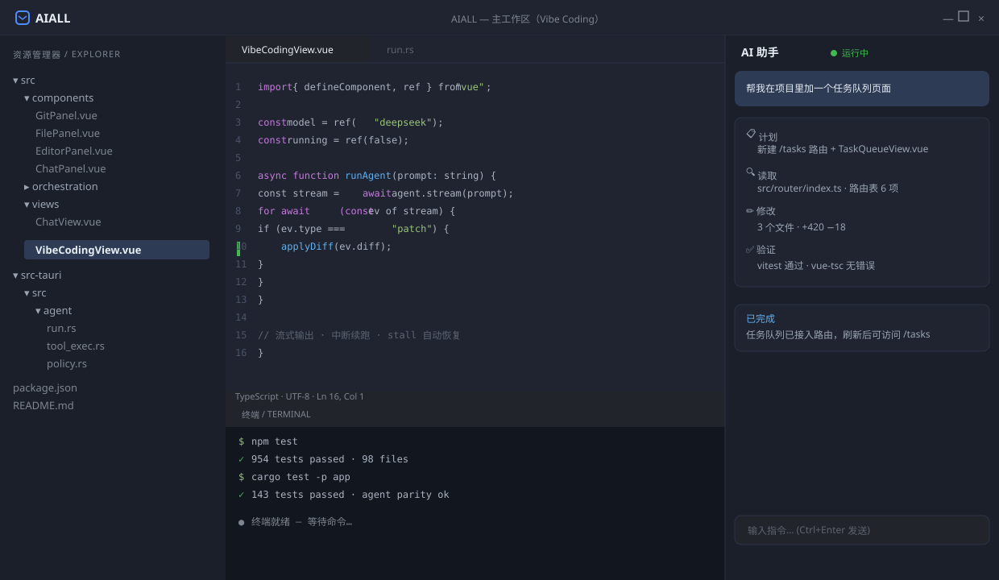

# AIALL

[](LICENSE)

AIALL 是一个开源的 **Cursor 类通用编程助手** 桌面应用（Tauri 2 + Vue 3）。它不只靠 Prompt 修个案——以 **上下文检索 + 工具闭环 + 模型泛化** 为能力来源：会查仓库、会改代码、会验证结果。

在本地项目上运行 Agent，提供文件树 / Git / Monaco 编辑器 / 会话聊天，并附带通用对话、图标模板桌面自动化与 AI 配置页。

## 功能特性

- **Agent 辅助编程（vibe coding）**：在本地项目上跑 Agent，支持 Ask / Build / Plan 模式、流式输出、中断与续跑、stall 自动恢复
- **文件 / Git / 编辑器三面板**：文件树导航、Git 状态与提交（含冲突解决）、Monaco 编辑器
- **会话持久化**：会话保存在本机 AppData，可跨启动恢复
- **通用对话（/chat）**：网页 URL 抓取总结、结合图标模板的桌面 UI 自动化（如「打开某应用」）
- **图标模板库（/icon-templates）**：录入任务栏 / 桌面截图模板，供桌面自动化匹配点击
- **架构图 / Code to Map**：项目面板生成代码映射图
- **任务队列（/tasks）**：后台任务管理
- **AI 配置页（/ai-config）**：图形化配置 API Key、模型与网页抓取代理

## 界面预览

> 主 IDE（Vibe Coding）布局示意：文件树 + Monaco 编辑器 + AI 助手 + 终端。
> 若需更逼真的展示，可自行补充真实界面截图到 `docs/screenshots/`。



## 环境要求

- Node.js 18+（含 npm）
- Rust 工具链（`rustup`，edition 2021）
- [Tauri 2 前置依赖](https://v2.tauri.app/start/prerequisites/)（Windows 为 WebView2，通常已随系统提供）

## 快速开始

```bash
# 1. 安装依赖
npm install

# 2. 桌面版开发（完整功能：Agent / Git / 文件系统走 Rust）
npm run dev

# 3. 打包
npm run tauri:build
```

启动后在 `/ai-config` 页面配置 AI 模型与 API Key 即可使用。配置存储在 AppData，不会写入仓库。

浏览器 UI 预览（部分功能不可用，提示使用桌面版）：

```bash
npm run dev:web
```

### 可用命令

| 命令 | 用途 |
|------|------|
| `npm run dev` | Tauri 桌面版（完整功能） |
| `npm run tauri:build` | 打包桌面应用 |
| `npm run dev:web` | 浏览器 UI 预览（Agent/Git/FS 不可用） |
| `npm test` | Vitest（契约 / 编排 / shared） |
| `npm run test:rust-agent` | Rust Agent 单测 |
| `npm run agent:smoke` | 无头桌面 Agent smoke（Rust） |
| `npm run agent:regression` | Rust 回归向量 + TS 分类器回归 |
| `npm run lint` | `vue-tsc --noEmit` 类型检查 |

## 架构

```
┌─────────────────────────────────────────────┐
│  前端（Vue 3 + TypeScript + Vite + Monaco）  │
│  src/views · src/components · src/composables│
└──────────────┬──────────────────────────────┘
               │ Tauri invoke / SSE
┌──────────────▼──────────────────────────────┐
│  Rust 后端（行为真相源）src-tauri/src/       │
│  agent/   Agent 主循环 / 工具执行 / 策略      │
│  fs/ git/ ai/ web/  文件·Git·AI·网页抓取      │
│  chat/   会话存储   project/ 健康扫描·CodeMap │
└──────────────┬──────────────────────────────┘
               │ 共享常量契约
┌──────────────▼──────────────────────────────┐
│  shared/  常量 / 截断 / 格式（TS-Rust parity）│
└─────────────────────────────────────────────┘
```

设计原则：**Rust 跑行为、TS 测契约、shared 钉常量**，禁止 TS/Rust 双写同一套行为实现。桌面运行时真相源为 `src-tauri/`；`server/` 仅保留 Vitest 契约 / parity，不作为实现真相源。

### 目录结构

| 路径 | 说明 |
|------|------|
| `src/views/VibeCodingView.vue` | AI 助手主页面（vibe coding） |
| `src/views/ChatView.vue` | 通用对话页 |
| `src/views/IconTemplatesView.vue` | 图标模板库 |
| `src/views/AiConfigView.vue` | AI 模型与 API 配置 |
| `src/orchestration/` | Agent 编排层（通用分类器 / 产品编排） |
| `src/components/vibe/` | Git / 文件 / 编辑器 / 聊天面板 |
| `src-tauri/src/agent/` | 桌面 Agent 运行时 |
| `src-tauri/src/commands/` | Tauri 命令（git / automation / ai / web） |
| `shared/` | TS-Rust 共享常量契约 |
| `server/` | Vitest 契约 / parity（非 HTTP） |

## 会话与数据存储

Vibe 会话文件存储在 AppData Roaming（不在项目目录内）：

- 会话消息：`%APPDATA%\aiall\vibe-chat-sessions\chat-<id>.json`
- 会话索引：`%APPDATA%\aiall\vibe-chat-sessions\chat-store.json`
- 调试日志：`%APPDATA%\aiall\debug-logs\`

## 测试

| 命令 | 覆盖 |
|------|------|
| `npm test` | TS 契约 / 编排 / 共享常量 parity |
| `npm run test:rust-agent` | Rust Agent parity 单测 |
| `npm run agent:test-guards` | Rust parity + 编排 guard + 机制回归 |

## 贡献

- 开发约定与术语表见 [`AGENTS.md`](AGENTS.md)
- 后端单一真相源见 [`AGENT_SSOT.md`](AGENT_SSOT.md)
- Agent 编排分层与通用性约束见 `.cursor/rules/`（`agent-orchestration.mdc`、`agent-reply-accuracy.mdc`）

## 许可证

[MIT](LICENSE)
