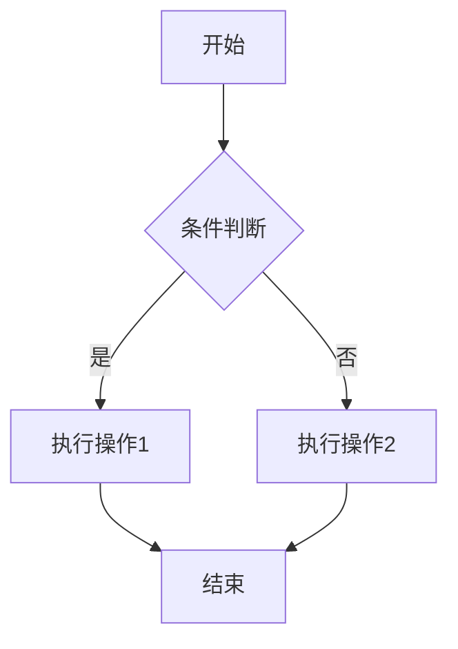
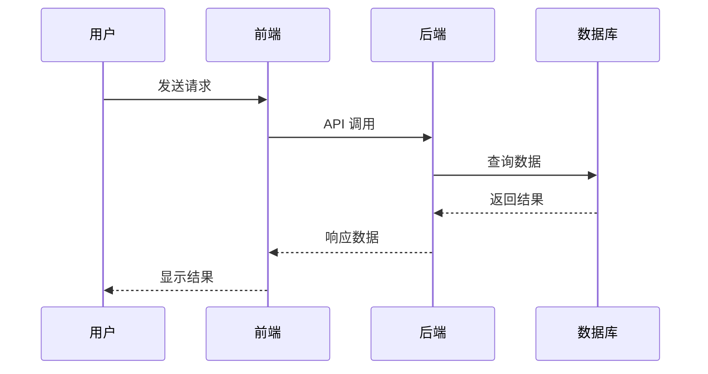
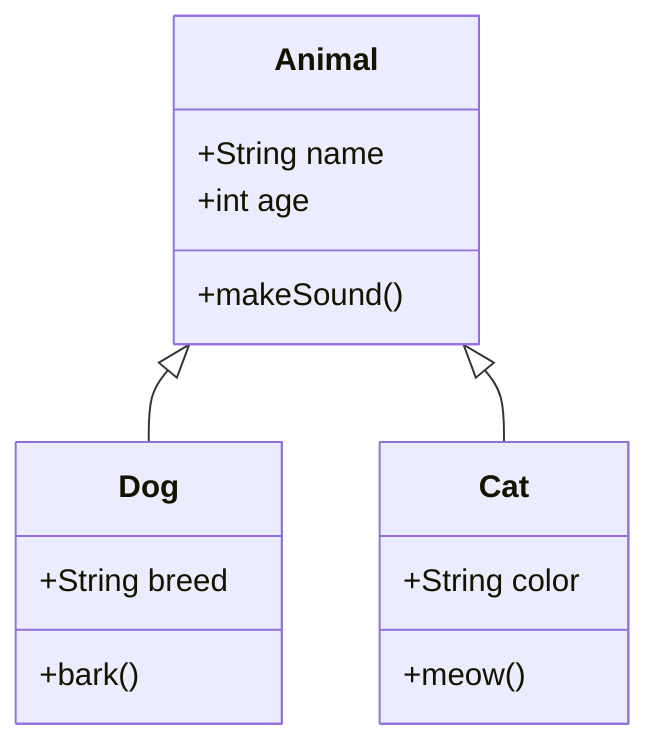
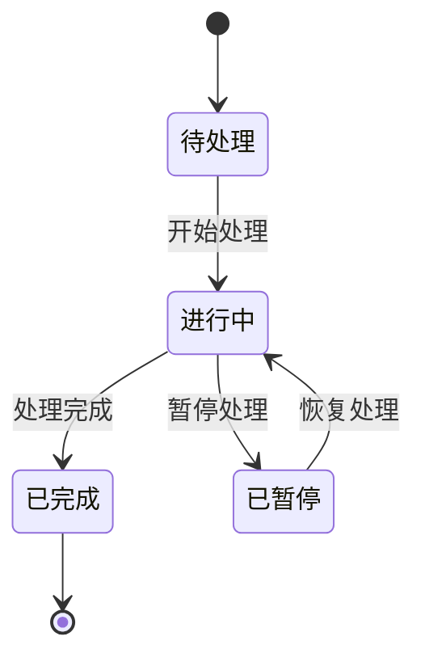
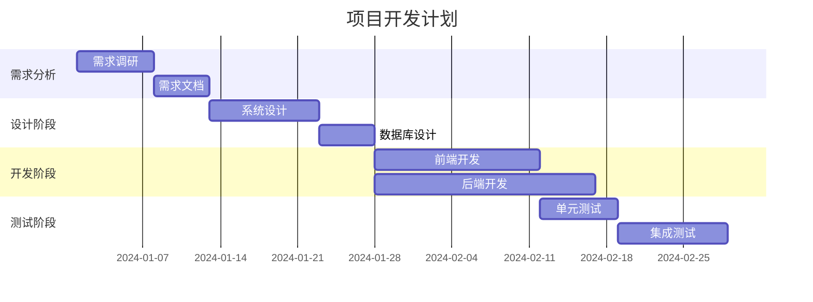
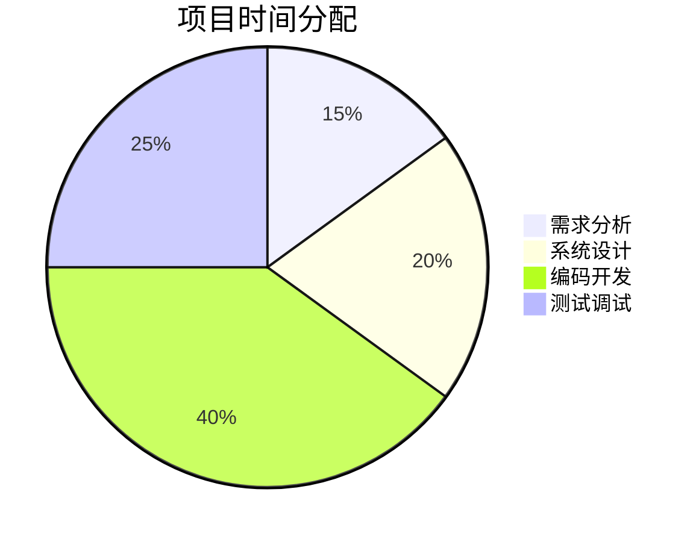
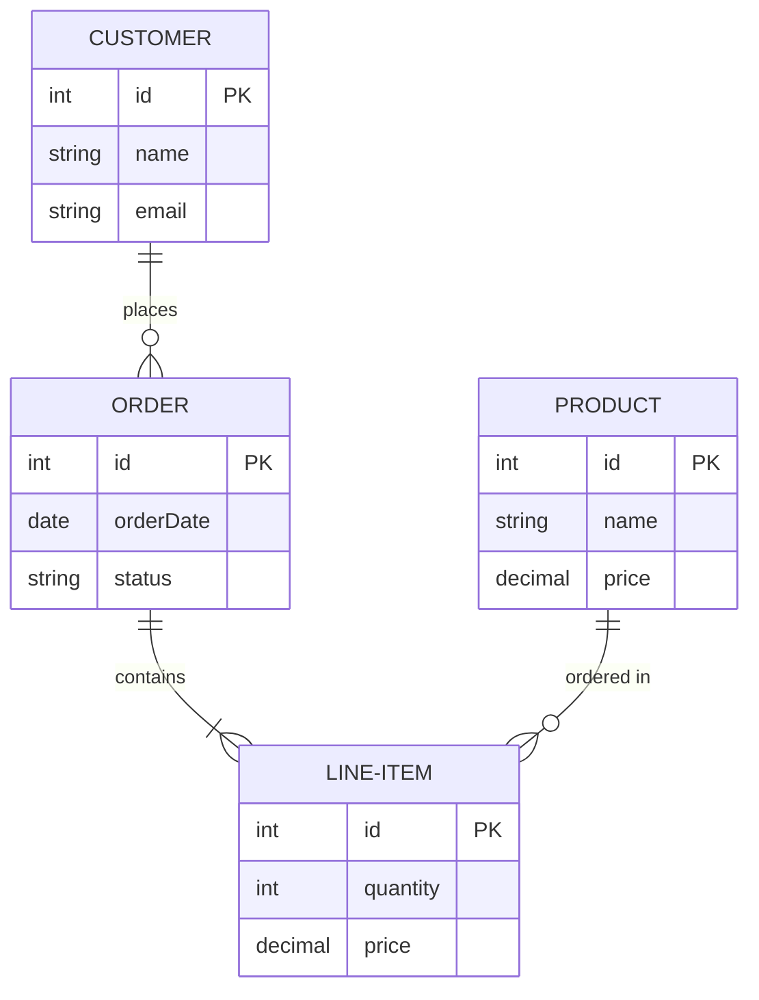
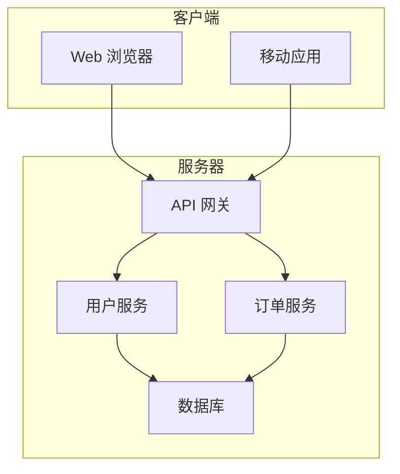
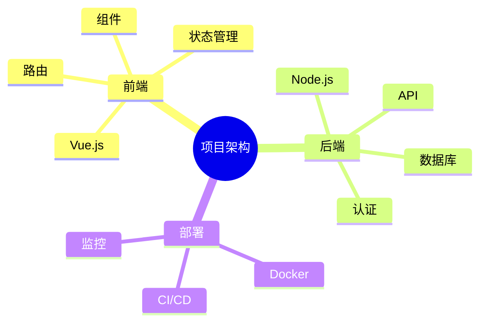

# Mermaid 测试示例

以下是一些 Mermaid 图表示例，用于测试渲染效果。

## 流程图

```mermaid
flowchart TD
    A[开始] --> B{条件判断}
    B -->|是| C[执行操作1]
    B -->|否| D[执行操作2]
    C --> E[结束]
    D --> E
```

## 时序图

```mermaid
sequenceDiagram
    participant 用户
    participant 前端
    participant 后端
    participant 数据库
    
    用户->>前端: 发送请求
    前端->>后端: API 调用
    后端->>数据库: 查询数据
    数据库-->>后端: 返回结果
    后端-->>前端: 响应数据
    前端-->>用户: 显示结果
```

## 类图

```mermaid
classDiagram
    class Animal {
        +String name
        +int age
        +makeSound()
    }
    
    class Dog {
        +String breed
        +bark()
    }
    
    class Cat {
        +String color
        +meow()
    }
    
    Animal <|-- Dog
    Animal <|-- Cat
```

## 状态图

```mermaid
stateDiagram-v2
    [*] --> 待处理
    待处理 --> 进行中: 开始处理
    进行中 --> 已完成: 处理完成
    进行中 --> 已暂停: 暂停处理
    已暂停 --> 进行中: 恢复处理
    已完成 --> [*]
```

## 甘特图

```mermaid
gantt
    title 项目开发计划
    dateFormat  YYYY-MM-DD
    section 需求分析
    需求调研     :a1, 2024-01-01, 7d
    需求文档     :a2, after a1, 5d
    section 设计阶段
    系统设计     :b1, after a2, 10d
    数据库设计   :b2, after b1, 5d
    section 开发阶段
    前端开发     :c1, after b2, 15d
    后端开发     :c2, after b2, 20d
    section 测试阶段
    单元测试     :d1, after c1, 7d
    集成测试     :d2, after d1, 10d
```

## 饼图

```mermaid
pie
    title 项目时间分配
    "需求分析" : 15
    "系统设计" : 20
    "编码开发" : 40
    "测试调试" : 25
```

## ER 图

```mermaid
erDiagram
    CUSTOMER ||--o{ ORDER : places
    ORDER ||--|{ LINE-ITEM : contains
    PRODUCT ||--o{ LINE-ITEM : "ordered in"
    
    CUSTOMER {
        int id PK
        string name
        string email
    }
    
    ORDER {
        int id PK
        date orderDate
        string status
    }
    
    LINE-ITEM {
        int id PK
        int quantity
        decimal price
    }
    
    PRODUCT {
        int id PK
        string name
        decimal price
    }
```

## 网络图

```mermaid
graph TD
    subgraph 客户端
        A[Web 浏览器]
        B[移动应用]
    end
    
    subgraph 服务器
        C[API 网关]
        D[用户服务]
        E[订单服务]
        F[数据库]
    end
    
    A --> C
    B --> C
    C --> D
    C --> E
    D --> F
    E --> F
```

## 思维导图

```mermaid
mindmap
  root((项目架构))
    前端
      Vue.js
      组件
      状态管理
      路由
    后端
      Node.js
      API
      数据库
      认证
    部署
      Docker
      CI/CD
      监控
```

这些示例涵盖了常见的 Mermaid 图表类型，可以用于测试渲染器的各种功能。